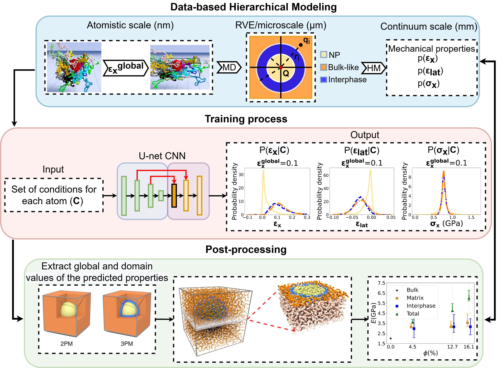

# DeepNANOMEC

Here we present a physics-aware deep learning approach for predicting the mechanical properties of
polymeric nanostructured materials.  
The method consists of three parts:
- Data-based hierarchical modeling: Which involves atomistic simulations and continuum models to compute distribution of stress and strain fields
- Training process: A deep learning model is developed to predict the distribution of mechanical properties at the atomic level for systems with specific set of features (**C**).
- Post-processing:  The trained neural network is utilized to predict the strain along the deformation direction (x-axis), the average of the strain on the lateral directions (y and z axis), and the stress along the deformation (x-axis) for each atom of the given atomistic configuration, conditioned on a set of features (**C**)
## Method implementation
This directory contains files to perform:
- The training of the machine learning model.
- The testing of the model on unknown data (test-set).
- The visualization of the results.
## Data
The data utilized for the training and testing of the deep neural network can be found in a Zenodo directory (10.5281/zenodo.17273740)
 

